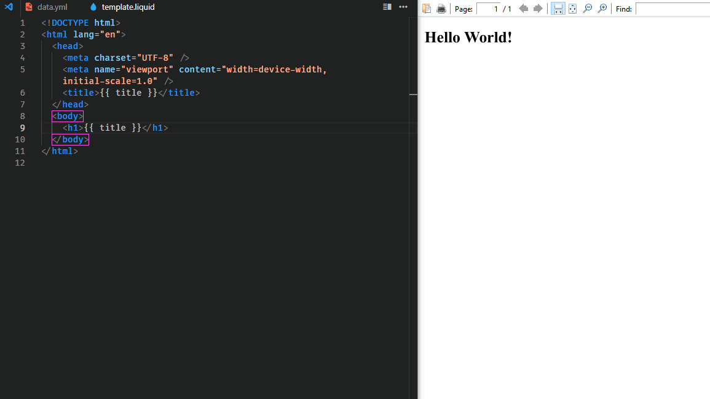

# PDF Made Easy

PDF Made Easy (PME) is a CLI application for building and developing PDF
documents.



## What this is

- A CLI you use to design and generate PDFs on your local machine using
  [Liquid](https://shopify.github.io/liquid) templates and
  [YAML](https://learnxinyminutes.com/yaml) data files. Under the hood, it uses
  [Puppeteer](https://pptr.dev) to create the PDFs.
- Something I created because I wanted to generate PDFs using the familiar HTML
  and CSS that I know.

## What this is NOT

- A library you use to incorporate into your scripts.
- Something you use on your server to generate PDFs on the fly. It's not very
  efficient to use a whole browser instance just to do that, using something
  like [PDFKit](https://pdfkit.org),
  [@pdfme/pdf-lib](https://github.com/pdfme/pdfme/tree/main/packages/pdf-lib),
  or [MuhammaraJS](https://github.com/julianhille/MuhammaraJS) would probably be
  better.

## Requirements

- [Node.js](https://nodejs.org), preferably
  [the latest Maintenance release or later](https://nodejs.org/about/previous-releases).

## Installation

### Global

```console
npm install --global pdf-made-easy
```

### Local

```console
npm install pdf-made-easy
```

## Usage

```console
pme
pme [options]
pme <command> [options]

Commands:
  pme        Same as 'dev' command                                     [default]
  pme dev    Watch data and template files and output PDF on change
  pme build  Output PDF using data and template files

Options:
  -h, --help      Show help                                            [boolean]
  -v, --version   Show version number                                  [boolean]
  -c, --config    Path to JavaScript config file                        [string]
  -d, --data      Path to YAML data file          [string] [default: "data.yml"]
  -o, --output    Path to PDF output file       [string] [default: "output.pdf"]
  -t, --template  Path to Liquid template file
                                           [string] [default: "template.liquid"]

Examples:
  pme
  pme -d info.yml
  pme dev -t ./templates/default.liquid
  pme build -o /home/user/document.pdf
  pme -d info.yml -t ./templates/default.liquid -o /home/user/document.pdf
```

### Passing options to Puppeteer and LiquidJS

You may want to specify options to change the default behavior of the libraries
that this CLI uses. For that, you can create a JavaScript config file that
exports a config object at the current working directory where you will invoke
`pme` or point to one using the `--config` flag. By default, `pme` will try to
find `pme.config.js`, `pme.config.mjs`, and `pme.config.cjs` in the current
working directory, in that order.

Let's say you don't want the Chrome instance Puppeteer will use to be sandboxed,
you want to be notified when you don't set variables in your YAML config file
that your Liquid template expects, and you want your PDF to be landscape. You
can create a `pme.config.mjs` with the following contents:

```js
import { defineConfig } from "pdf-made-easy";

export default defineConfig({
	launchOptions: { args: ["--no-sandbox"] },
	liquidOptions: { strictVariables: true },
	pdfOptions: { landscape: true },
});
```

`defineConfig` is a helper to give you autocompletion and to check that you've
provided the correct config keys. All of these settings are optional, you can
provide some, a few, or none of them. Below are links to further documentation
for what other options you can set:

- [`launchOptions`](https://pptr.dev/api/puppeteer.launchoptions)
- [`liquidOptions`](https://liquidjs.com/api/interfaces/LiquidOptions.html)
- [`pdfOptions`](https://pptr.dev/api/puppeteer.pdfoptions)

**Note:** For `launchOptions`, `handleSIGHUP`, `handleSIGINT`, and
`handleSIGTERM` are always set to `false` since `pme` handles those signals
itself. When it comes to `pdfOptions`, `path` is always set to what is passed to
the `--output` flag.

## License

Copyright 2023-present Matthew Espino

This project is licensed under the [Apache 2.0 license](LICENSE).
