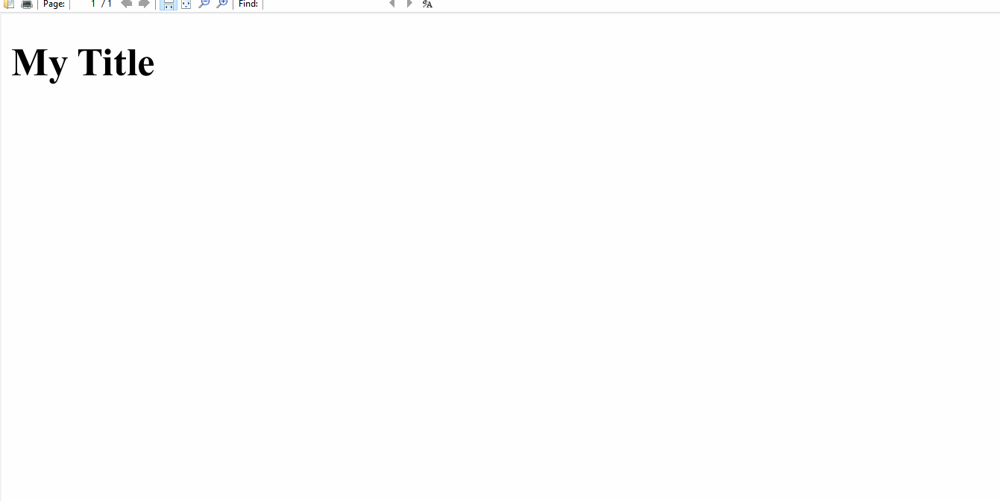

# PDF Made Easy

PDF Made Easy (PME) is a CLI application and library for developing and creating PDF documents.



## Rationale

There are tons of PDF-generation tools out there. So, why make another one?

Well, I wanted an easy way to make customizable resumes. My previous solution, [Polymorphic Resume](https://github.com/mcecode/polymorphic-resume), was overengineered to oblivion and cumbersome to use. So, I set out and looked at alternative solutions (e.g., [resume-cli](https://github.com/jsonresume/resume-cli), [electron-pdf](https://github.com/fraserxu/electron-pdf), [pdfgen](https://github.com/hausgold/pdfgen), [document-generator](https://github.com/adzialocha/document-generator), [ezPDF](https://github.com/heyset/ezpdf)), but none matched all of the things that I was looking for, which are:

- Use web technologies rather than TeX-based solutions to generate PDFs
- Freedom to easily put whatever data in whatever template I want
- Real-time preview of document changes in PDF format rather than in an intermediate format like HTML

Thus, PME was born.

## How it works

To fulfill the requirements that I was looking for, the PME CLI takes data from a [YAML](https://yaml.org), [JSON](https://www.json.org/json-en.html), JSON with Comments (JSONC), or [JSON5](https://json5.org) file and injects it into a template to generate HTML which is then used to generate a PDF using [Puppeteer](https://pptr.dev). This process is repeated whenever there are changes to either the data or template file so that the PDF preview can refresh automatically.

Presently, the default template engine used to generate HTML is [Liquid](https://liquidjs.com). This can be changed when using PME as a library, but not as a CLI. However, in the future, [it is planned](#todos) to make this configurable in the CLI as well via [the config file](docs/01-cli.md#configuration).

Additionally, the autorefresh feature currently only works if the viewer used to preview the PDF supports repainting when there are changes to the PDF file. Though, it is also in [the plan](#todos) to add an auto-reloading viewer together with the CLI to make previewing changes more streamlined.

## Requirements

- [Node.js](https://nodejs.org), preferably [the latest Maintenance release or later](https://github.com/nodejs/release#release-schedule).

## Installation

### Global

```console
npm install --global pdf-made-easy
```

### Local

```console
npm install pdf-made-easy
```

## Usage

- [CLI documentation](docs/01-cli.md)
- [API documentation](docs/02-api.md)

## TODOs

### Documentation

- [ ] Finish documentation
- [ ] Add examples

### Tests

- [ ] Migrate CLI tests to JavaScript
- [ ] Add more CLI tests
- [ ] Add unit tests
- [ ] Add tests for type definitions

### CLI

- [ ] Custom template engine via a `getTemplateRenderer` method in the config file
- [ ] Auto-reloading preview of the generated PDF via a `--preview` or `-p` option
- [ ] Using a separate stylesheet via a `--style` or `-s` option
- [ ] Serving local assets for PDF embedding via `--serve` and `--port` options (ideas for implementation: [1](https://stackoverflow.com/a/67505480), [2](https://github.com/puppeteer/puppeteer/issues/1643))
- [ ] Multiple data and template inputs and PDF outputs via an `entries` property in the config file

### API

- [ ] Make the `getTemplateRenderer` command argument optional

## Contributing

If you find anything wrong or would like to suggest changes, issues and pull requests are welcome. Additionally, help with implementing the [todos](#todos) would be appreciated.

## Versioning

This project adheres to the [Semantic Versioning 2.0 Specification](https://semver.org).

## License

Copyright 2023-present Matthew Espino

This project is licensed under the [Apache 2.0 license](LICENSE).
